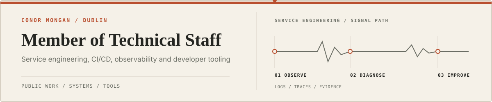
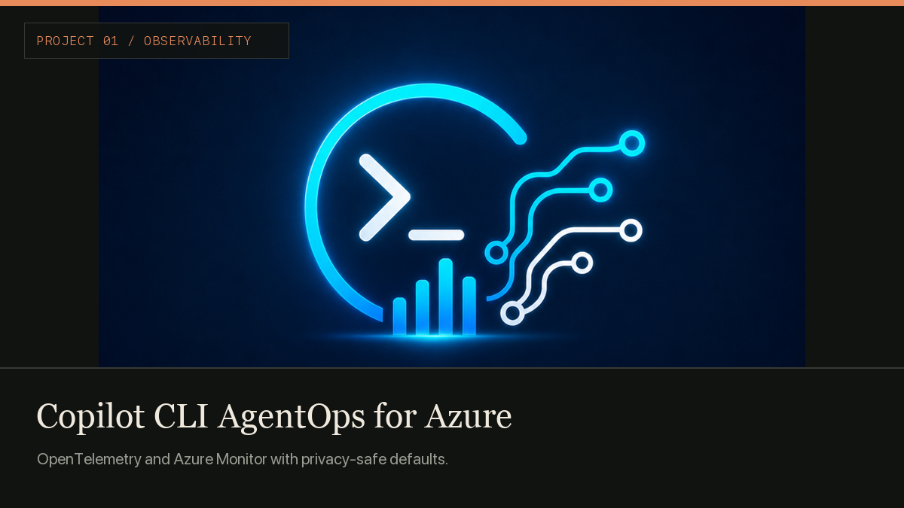
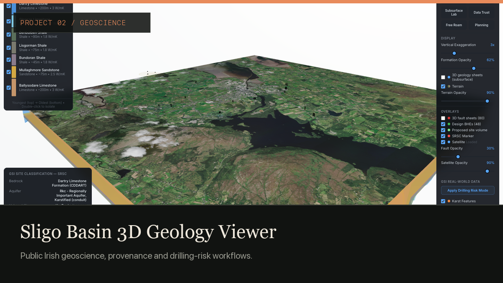

<picture>
  <source media="(prefers-color-scheme: dark)" srcset="assets/header-dark-v3.svg">
  <source media="(prefers-color-scheme: light)" srcset="assets/header-light-v3.svg">
  
</picture>

I investigate difficult systems problems, explain them clearly, and build tools that make the next incident easier to solve.

### Selected work

<table>
  <tr>
    <td width="50%" valign="top">
      
       
      <a href="https://github.com/c-mongan/copilot-cli-agentops-azure">Repository</a> · <a href="https://github.com/c-mongan/copilot-cli-agentops-azure/blob/main/docs/simplified-azure-design.md">Architecture</a>
    </td>
    <td width="50%" valign="top">
      
       
      <a href="https://github.com/c-mongan/sligo-geology-viewer">Repository</a> · <a href="https://sligo-digital-twin.vercel.app/">Live demo</a>
    </td>
  </tr>
  <tr>
    <td colspan="2" valign="top">
      <h3><a href="https://github.com/c-mongan/livekit-voice-studio">Voicebox Studio</a></h3>
      
Talk with GitHub Copilot or OpenAI Codex using local speech recognition and a voice you choose. An open-source developer preview for Apple Silicon.

      
       
      <a href="https://github.com/c-mongan/livekit-voice-studio">Repository &amp; quickstart</a> · <a href="https://github.com/c-mongan/livekit-voice-studio/blob/main/docs/preview-release.md">Tested scope &amp; limitations</a>
    </td>
  </tr>
</table>

**Also:** [Agent Systems Field Guide](https://github.com/c-mongan/agent-systems-field-guide) · [Support Triage Template](https://github.com/c-mongan/support-triage-agent-template)

[LinkedIn](https://www.linkedin.com/in/conor-mongan)
