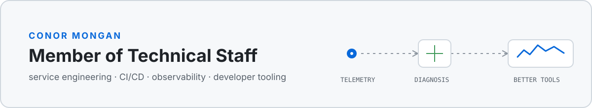

<picture>
  <source media="(prefers-color-scheme: dark)" srcset="assets/header-dark.svg">
  <source media="(prefers-color-scheme: light)" srcset="assets/header-light.svg">
  
</picture>

I investigate difficult systems problems, explain them clearly, and build tools that make the next incident easier to solve.

### Selected work

<table>
  <tr>
    <td width="50%" valign="top">
      
        
      <strong><a href="https://github.com/c-mongan/copilot-cli-agentops-azure">Copilot CLI AgentOps for Azure</a></strong>
       
      Privacy-first observability for Copilot CLI, SDK and MCP workloads using OpenTelemetry and Azure Monitor.
    </td>
    <td width="50%" valign="top">
      
        
      <strong><a href="https://github.com/c-mongan/sligo-geology-viewer">Sligo Basin 3D Geology Viewer</a></strong>
       
      An interactive Three.js viewer built from public Irish geoscience data, with provenance and drilling-risk workflows.
    </td>
  </tr>
</table>

**Also:** [Agent Systems Field Guide](https://github.com/c-mongan/agent-systems-field-guide) · [Support Triage Template](https://github.com/c-mongan/support-triage-agent-template)

[LinkedIn](https://www.linkedin.com/in/conor-mongan)
