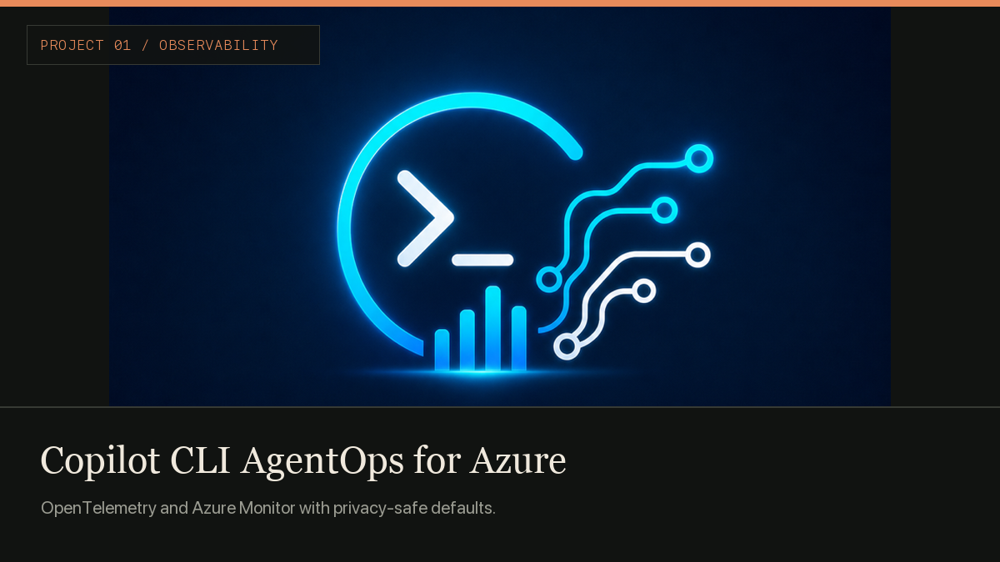
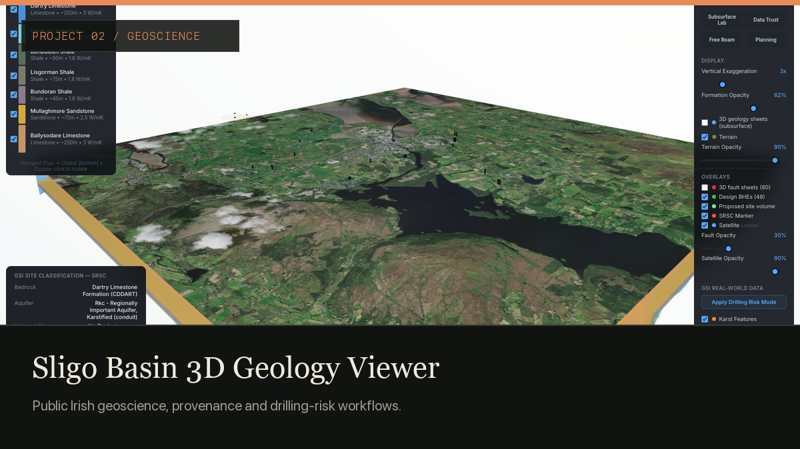

I investigate difficult systems problems, explain them clearly, and build tools that make the next incident easier to solve.

Member of Technical Staff at [Microsoft](https://www.microsoft.com/) · previously Technical Support Engineer II at [Datadog](https://www.datadoghq.com/)

### Selected work

<table>
  <tr>
    <td width="50%" valign="top">
      
       
      <a href="https://github.com/c-mongan/copilot-cli-agentops-azure">Repository</a> · <a href="https://github.com/c-mongan/copilot-cli-agentops-azure/blob/main/docs/simplified-azure-design.md">Architecture</a>
    </td>
    <td width="50%" valign="top">
      
       
      <a href="https://github.com/c-mongan/sligo-geology-viewer">Repository</a> · <a href="https://sligo-digital-twin.vercel.app/">Live demo</a>
    </td>
  </tr>
  <tr>
    <td colspan="2" valign="top">
      <strong><a href="https://github.com/c-mongan/livekit-voice-studio">Voicebox Studio</a></strong> 
      Runs speech recognition and voice generation on the Mac. Reasoning can stay local or use a configured provider. 
      <a href="https://github.com/c-mongan/livekit-voice-studio">Repository &amp; quickstart</a> · <a href="https://github.com/c-mongan/livekit-voice-studio/blob/main/docs/preview-release.md">Tested scope &amp; limitations</a>
    </td>
  </tr>
</table>

**More:** [Agent Systems Field Guide](https://github.com/c-mongan/agent-systems-field-guide) · [Resumake CV Generator](https://github.com/c-mongan/resumake-latex-cv) · [Safe Storage Optimizer](https://github.com/c-mongan/safe-storage-optimizer)
