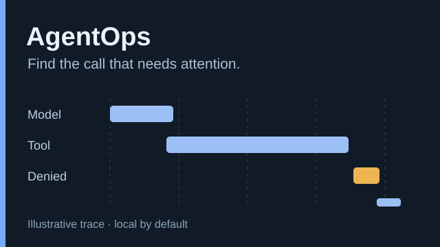
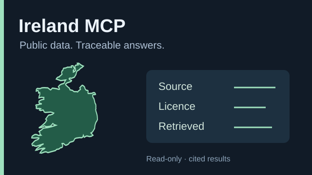
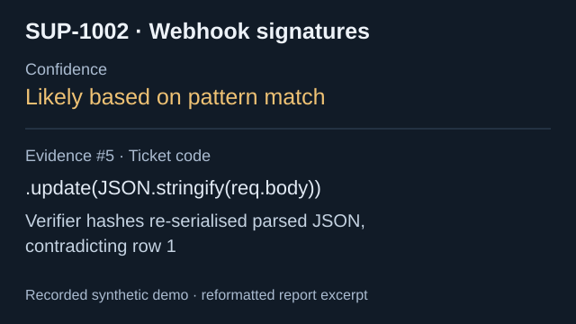
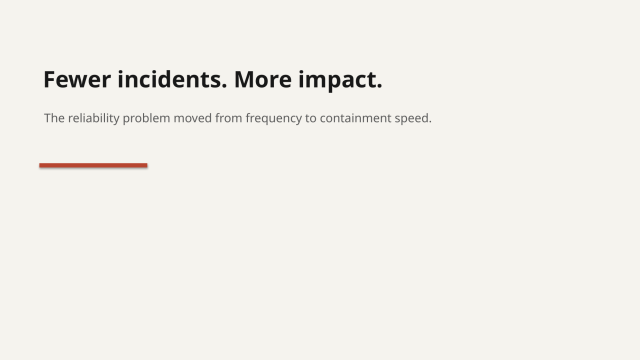

# Conor Mongan

I investigate difficult systems problems, explain them clearly, and build tools that make the next incident easier to solve.

Member of Technical Staff at **Microsoft** · previously Technical Support Engineer II at **Datadog** · Dublin, Ireland

## Selected projects

Open a project to try it or inspect the code. Architecture links open the detailed explanations.

<table>
  <tr>
    <td width="50%" valign="top">
      
      <h3>Copilot CLI AgentOps</h3>
      
Inspect failed or slow calls in local AI-agent traces.

      
<a href="https://github.com/c-mongan/copilot-cli-agentops-azure#readme">Demo</a> · <a href="https://github.com/c-mongan/copilot-cli-agentops-azure">Code</a> · <a href="assets/diagrams/agentops-light.png">Architecture</a>

      Preview · Azure optional
    </td>
    <td width="50%" valign="top">
      
      <h3>Ireland MCP</h3>
      
Ask questions about Irish public data and follow the citations.

      
<a href="https://irishopendata.ie">Demo</a> · <a href="https://github.com/c-mongan/ireland-mcp">Code</a> · <a href="assets/diagrams/ireland-mcp-light.png">Architecture</a>

      Read-only public data
    </td>
  </tr>
  <tr>
    <td width="50%" valign="top">
      
      <h3>Support Triage Agent</h3>
      
Investigate a support case and draft an evidence-graded reply.

      
<a href="https://github.com/c-mongan/support-triage-agent-template/tree/main/docs/demo">Demo</a> · <a href="https://github.com/c-mongan/support-triage-agent-template">Code</a> · <a href="assets/diagrams/support-triage-light.png">Architecture</a>

      Synthetic demos · human review
    </td>
    <td width="50%" valign="top">
      
      <h3>Effects Atlas</h3>
      
Explore 40 React effects and recipes, then download a working starter.

      
<a href="https://c-mongan.github.io/effects-atlas/">Demo</a> · <a href="https://github.com/c-mongan/effects-atlas">Code</a> · <a href="https://c-mongan.github.io/effects-atlas/storybook/">Storybook</a>

      Interactive gallery
    </td>
  </tr>
  <tr>
    <td width="50%" valign="top">
      
      <h3>LiveKit Voice Studio</h3>
      
Talk to AI with local speech and a choice of reasoning providers.

      
<a href="https://github.com/c-mongan/livekit-voice-studio/blob/main/docs/demo.md">Demo</a> · <a href="https://github.com/c-mongan/livekit-voice-studio">Code</a> · <a href="https://github.com/c-mongan/livekit-voice-studio/blob/main/docs/local-cloud-components.md">Architecture</a>

      Development preview · Apple Silicon
    </td>
    <td width="50%" valign="top">
      
      <h3>Narrated Deck Studio</h3>
      
Turn source material into reviewed presentations, narration and captions.

      
<a href="https://github.com/c-mongan/narrated-deck-studio/tree/main/packages/world-class-decks/examples/demo">Sample</a> · <a href="https://github.com/c-mongan/narrated-deck-studio">Code</a> · <a href="https://github.com/c-mongan/narrated-deck-studio/blob/main/docs/ARCHITECTURE.md">Architecture</a>

      Bundled sample slide · in development
    </td>
  </tr>
</table>

[Editable diagrams and source credits](docs/diagrams.md)

## Tools and contact

**Observability:** OpenTelemetry, Azure Monitor, KQL, Datadog

**Build:** TypeScript, Python, Azure Functions, GitHub Actions, MCP and Agent Skills

[Agent Systems Field Guide](https://github.com/c-mongan/agent-systems-field-guide) · [Safe Storage Optimizer](https://github.com/c-mongan/safe-storage-optimizer) · [LinkedIn](https://www.linkedin.com/in/conor-mongan/)

Independent personal projects. Project documentation records tested scope and release limitations.
